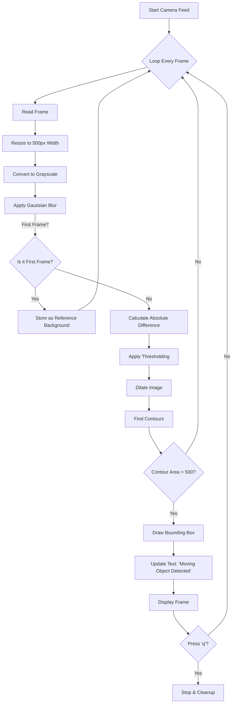

# Moving Object Detection - System Architecture

This document provides a high-level visual and technical breakdown of the Motion Detection logic implemented in `MovingObjectDetection.py`.

## 1. Logic Flowchart
The following diagram illustrates the frame processing pipeline from input to detection:

## 2. Technical Process Breakdown

| Step | Function Used | Purpose | Why it matters? |
| :--- | :--- | :--- | :--- |
| **1. Pre-processing** | `cv2.cvtColor(rgb, cv2.COLOR_BGR2GRAY)` | Converts color image to varying shades of gray. | Reduces computational complexity; color is irrelevant for motion. |
| **2. Noise Reduction** | `cv2.GaussianBlur(gray, (21, 21), 0)` | Smooths the image details. | Removes high-frequency noise (like grain) that could be mistaken for movement. |
| **3. Difference Calculation** | `cv2.absdiff(firstFrame, currentFrame)` | Subtracts current view from the static background. | Highlights *only* what has changed pixels. |
| **4. Binarization** | `cv2.threshold(diff, 25, 255, ...)` | Converts the 'difference' to pure Black (Bg) or White (Motion). | Makes it easy for the computer to "see" shapes. |
| **5. Object Isolation** | `cv2.findContours` & `cv2.boundingRect` | Detects the borders of white blobs. | Allows us to draw boxes around the distinct moving items. |

## 3. Configuration Constants
These values determine the sensitivity of the detection.

| Variable | Value | Description |
| :--- | :--- | :--- |
| `area` | `500` | Minimum size (in pixels) for an object to be considered "moving". Smaller changes are ignored. |
| `Gaussian Kernel` | `(21, 21)` | The strength of the blur. Higher numbers = blurry image = less sensitive to small light flickers. |
| `Threshold Limit` | `25` | Use to decide if a pixel change is significant enough to be "motion". |

## 4. Operational States

| State | Status Text | Condition | visual Output |
| :--- | :--- | :--- | :--- |
| **Idle** | "Normal" | No contour > 500px area found. | Clean video feed. |
| **Active** | "Moving Object detected" | At least one contour > 500px found. | Green Rectangle around object + Red Warning Text. |
